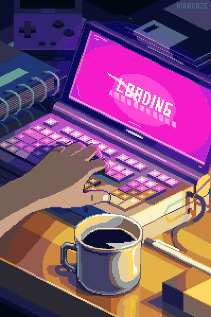

<h1 align="center">
  </h1>
                                        

<h3 align="center">A passionate Programmer from India</h3>

- 🌱 I’m currently learning **AI/ML,Python and Exploring Hardware**

- 💬 Ask me about **Arduino UNO,ESP and C**

<h3 align="left">Connect with me:</h3>

<h3 align="left">Languages and Tools:</h3>

  

<h2>Contact Me</h2> 

&nbsp;

&nbsp;
&nbsp;

&nbsp;

Developed with ❤️ in India 🇮🇳 

